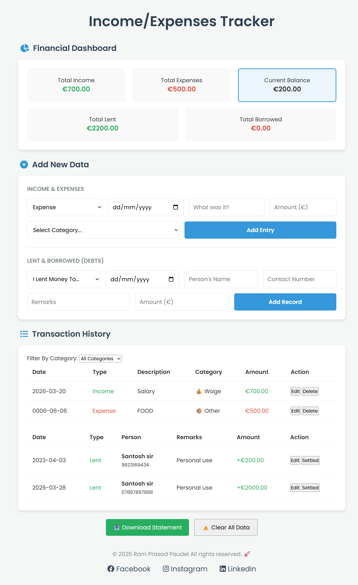
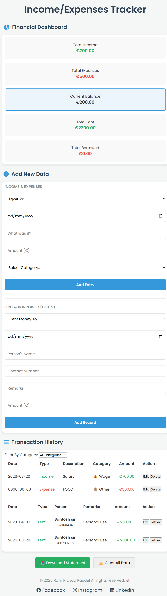

#  Income & Expenses Tracker
 A simple and powerful tool to track your money, debts, and savings in one place.Most expense trackers only show what you spend at a store. This project, built for **Web Applications - Project 1**, solves a common real-world problem: tracking **informal money flow**. 

Whether you are lending 10 Euro to a friend for lunch or borrowing money for a bill, this app provides a 100% accurate picture of your financial health. By combining a **Standard Expense Tracker** with a **Debt Management System**, users can see exactly how much they *actually* have versus what they are owed.

**🔗 [Click Here to Open the Live App](https://ram-prasad-paudel.github.io/Income-Expenses-Tracker/)**

## 📸 Interface Preview

### 🖥️ Desktop Dashboard View
This screenshot shows the application running on a full-size computer screen. 
* **Layout:** Uses a wide-screen dashboard layout.
* **Functionality:** You can see the main balance card, the input forms for adding transactions, and the scrollable history list all in one clear view.

---

### 📱 Mobile Responsive View
This screenshot shows the application running on a mobile phone screen.
* **Responsiveness:** When opened on a smartphone, the interface automatically stacks the elements vertically to fit a narrow screen.
* **Touch-Friendly:** Buttons and form fields remain easy to tap and navigate, ensuring a smooth user experience on the go.

#  What is this project?
Most basic expense trackers only show a list of what you spend at a store. I realized that for many people, especially students and friends, a large part of their "financial health" involves informal money flow — lending someone 10 Euro for lunch or borrowing money for a shared bill.

This app bridges that gap. It is a specialized Dashboard that tracks:

**Standard Transactions**: Your Everyday income and expenses.

**Informal Debts**: A dedicated system to track money you are owed or money you owe others.

I built this using modern web technologies to ensure it works perfectly on both your computer and your mobile phone.

## ✨ Main Features 
* **Dynamic DOM Manipulation:** The UI updates instantly using JavaScript whenever you add or delete a transaction.
* **JavaScript Event Handling:** Uses event listeners to capture user inputs from buttons and forms.
* **Smart Form Validation:** Ensures all required fields (Amount, Category, Date) are filled correctly before saving.
* **Data Persistence (Web Storage API):** Utilizes `localStorage` and JSON serialization to save your financial data permanently.
* **Category Filtering:** Uses array methods to filter and display specific transaction types (Wage, Food, Bills, etc.).
* **Responsive CSS Grid & Flexbox:** A mobile-first layout designed with Media Queries for all screen sizes.

---

### How to run  for Windows & macOS:
1. **Download:** Click the green **"Code"** button at the top of this repository and select **"Download ZIP"**.
2. **Unzip:** Extract the folder to a location on your computer.
3. **Launch:** - **Windows:** Double-click the `index.html` file to open it in Chrome or Edge.
   - **macOS:** Right-click `index.html` and select **"Open With"** > **"Google Chrome"** or **"Safari"**.
   
### My Learning Reflection: 
"Building this Income and Expense Tracker was a great experience that helped me understand how JavaScript works in a real project. My main goal was to create a simple Dashboard that helps people manage their money. Most apps only track spending, so I wanted mine to be special by also tracking personal debts, like when you lend money to a friend or borrow some from family.

One of the biggest technical parts of this project was using the DOM (Document Object Model) . I learned how to use JavaScript to 'talk' to my HTML. For example, when a user clicks 'Add', my code creates a new table row instantly without reloading the page. This makes the app feel fast and modern.

However, I faced several problems during development. At first, my data would disappear every time I hit refresh. To fix this, I learned how to use localStorage . I had to turn my data into a 'JSON string' to save it and then parse it back into a list when the app started again. Another problem was the design; initially, the tables were too wide for a phone screen and looked broken. I solved this by using CSS Flexbox and Media Queries to make the layout stack vertically on mobile.

In the future, I want to improve this project by adding colorful pie charts to show spending patterns. This project has made me much more confident in my coding skills and my ability to solve technical problems. I now feel much more comfortable handling user inputs and managing data in the browser.
Special thanks to Teacher **Paresh Rathod** and my classmates for the support throughout this journey!
## ✅ Project Self-Assessment

| Rubric Category | Self-Score | Technical Justification |
| :--- | :--- | :--- |
| **Logic & Functionality** | **9 / 10** | The app successfully manages two distinct data arrays (Transactions and Debts). All CRUD operations (Create, Read, Update, Delete) work smoothly. I deducted 1 point as I plan to add more advanced date-range sorting in a future version. |
| **Data Handling** | **4 / 4** | Full implementation of the Web Storage API. I used `JSON.stringify` for serialization and `JSON.parse` for retrieval, wrapped in a `try/catch` block to handle potential browser storage errors. |
| **UX & Accessibility** | **4 / 5** | The UI uses a mobile-first approach with CSS Flexbox. Accessibility is handled through clear labels and high-contrast text. A 1-point deduction acknowledges that adding a charting library (like Chart.js) would further enhance the user's data visualization. |
| **Security** | **3 / 3** | I implemented a custom `escapeHTML` function to sanitize all user-generated content. This prevents Cross-Site Scripting (XSS) by ensuring that characters like `<` and `>` are converted to HTML entities before being rendered to the DOM. |
| **Code Quality** | **5 / 5** | The code follows ES6+ standards, utilizing arrow functions and template literals. I maintained a "DRY" (Don't Repeat Yourself) structure by using helper functions like `saveToMemory()` and `getCategoryEmoji()`. |
| **Video Demo** | **3 / 5** | The recorded video demonstrates all core features and basic code structure. While it meets all submission requirements, it could be made extra by covering all technical requirements and code logic in even greater depth. |
| **Documentation** | **3 / 3** | The README is comprehensive, featuring a detailed project description, step-by-step local setup for both Windows and macOS, UI screenshots, and a 200+ word technical reflection. |
## Author
**Ram Prasad Paudel**
